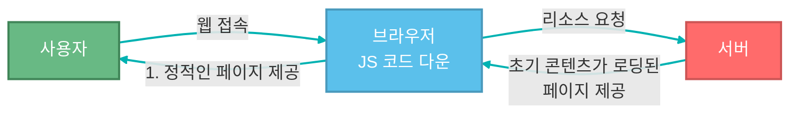

# CSR과 SSR


### 1. 웹 애플리케이션의 역사

#### 1. 초창기의 웹
초창기의 웹은 당연스럽게도 텍스트 중심의 단순 문서에 그쳐있엇다. like 신문
그래서 MPA(Multi Page Application)방식으로 이우어져 있어 변경사항이 있을 때마다 서버로 페이지를 요청해야했습니다.

> MPA 방식을 사용할 경우 서버로부터 새로운 html파일을 내려받아 로딩하는 경우가 많아, 사용자가 깜빡이는 화면을 많이 볼 수 있었습니다. 

그러나 웹의 발달로 페이지에 사진이나 동영상 등의 미디어와 인터랙션이 많이 생겨 복잡도가 높아지면서 성능 이슈가 생겼다. 계속되는 깜빡이는 환경을 유저 입장에서는 좋지 않는 경험이었겠죠.

#### 2. AJAX의 등장

> `AJAX(Asynchronous JavaScript and XML)`
>  비동기적 웹 애플리케이션을 위한 기법.
>  전통적인 웹 페이지가 새로운 데이터를 보여주기 위해 페이지 전체를 다시 로드해야 했던 것과 달리, Ajax는 필요한 데이터만 서버로부터 받아와 페이지의 일부분만 업데이트할 수 있게 해줍니다.

##### 1. Ajax의 주요 특징
> 1. **비동기성(Asynchronous)**: 서버와의 통신이 백그라운드에서 이루어집니다.
> 2. **부분 업데이트**: 페이지 전체가 아닌 필요한 부분만 업데이트가 가능합니다.
> 3. **향상된 사용자 경험**: 끊김 없는 웹 경험을 제공합니다.


##### 2. 기본 동작 과정
1. 클라이언트에서 XMLHttpRequest 객체를 생성
2. 서버에 요청
3. 서버는 요청을 처리-> 반환
4. 클라이언트가 응답 처리 후 페이지 생성

##### 3. Ajax의 장단점
**장점**
> - 페이지 전체를 새로고침하지 않고 데이터를 업데이트 할 수 있다.
> - 서버 부하를 줄일 수 있다.
> - 사용자 경험 증가
> - 비동기적 통신 가능

**단점**
> * 뒤로가기 버튼이 제대로 작동 안하는 경우가 종종 확인 가능했다.
> * 검색 엔진 최적화(SEO)에 어려움이 있을 수 있습니다.
> * JavaScript가 비활성화된 환경에서는 작동하지 않을 수 있습니다.


#### 3. MPA/SPA
|MPA|SPA|
|-|-|
|SSR|CSR|
|변경사항이 있을 때마다 서버로 페이지 요청 후 새로 렌더링|단일 페이지로 갱신될 부분에 대해서만 데이터 요청 후 렌더링|

#### 4. CSR/SSR

##### 1. CSR
>`CSR(Client Side Rendering)`은 클라이언트 측에서 렌더링을 담당하여, 첫 로딩에 빈 html 파일에 필요한 번들 파일들을 모두 다운로드 받음

##### 2. CSR의 동작 흐름

 ```mermaid
flowchart LR
	classDef user fill:#68B984,stroke:#408558,stroke-width:2px,color:white 
	classDef browser fill:#5BC0EB,stroke:#4999BC,stroke-width:2px,color:white 
	classDef server fill:#FF6B6B,stroke:#CC5555,stroke-width:2px,color:white 
	classDef arrow stroke:#2D3436,color:#2D3436
	
	user[사용자]:::user
	browser[브라우저]:::browser
	server[서버]:::server
	
	user<-->|웹 접속/페이지 제공| browser
	browser<--> |리소스 요청/JS, CSS를 불러 올 수 있는<br/>빈 html 파일| server
```


* TTFB(Time to First Byte)가 빠름
  * 요청을 보내고 응답의 첫번째 바이트가 도착하기까지의 시간
* FCP(First Contentful Paint)가 좋지 않음
  * 사용자가 화면에서 콘첸츠를 볼 수 있는 페이지 로드 타임라인의 첫 지점


##### 3. SSR
> `SSR(Server Sdie Rendering)` 은 서버 측에서 렌더링 될 페이지를 그려 클라이언트로 내려주는 방식이며, 요청 즉시 HTML 파일을 만드는 방식

##### 3.1 SSR 동작 흐름


* FCP(Pirst Contentful Paint)는 빠름
* TBT(Total Blocking Time)은 느림
  * FCP로부터 TTL(Time To Interact)사이의 시간
  * TTl(Time To interact) - 사용자가 페이지에서 상호작용이 가능하기까지의 시간

##### 4. SSG
> `SSG(Static Site Generation)`은 SSR과는 약간 다른 방식으로, 미리 다 만들어둔 정적 페이지를 제공하는 방식


#### 5. CSR과 SSR 비교

| 구분  | **CSR**                                            | **SSR**                                               |
|-----|----------------------------------------------------|-------------------------------------------------------|
| 장점  | 화면 깜빡임이 없어 좋은 사용자 경험 제공 <br>- 초기 로딩 이후 구동 속도가 빠름 | 초기 로딩속도가 빠름<br>- SEO가 쉬움                            |
| 단점  | 초기 구동 속도가 느림<br> SEO가 어려움                       | 페이지를 이동할 때 화면이 깜빡임 <br> 매번 요청을 보내기 때문에 서버에 과부하가 있음 |


##### 5.1 SEO(Search Engine Optimization)
> `검색봇이 웹사이트를 크롤링할 때`
> CSR -  빈 html(CSR) 상태에 정보 수집이 어려움
> SSR - html 파일이 비어있지 않아 정보 수집에 이점이 있음 


#### 6. 뭐가 더 좋은가?
더 좋은 렌더링 방식은 개발 방향에 맞춰서 선택해야한다.
이용자가 많이 필요한 부분에서는 SSR, 아니라면 CSR로 취사선택을 하면된다 생각합다.

> 두가지 혼합해서 사용하는 방식 또한 있음(universal Rendering)
> 초기 렌더링은  SSR, 다른 페이지 이동은 CSR로 혼합해서 사용


#### 참고
[\[10분 테코톡\] 타미의 CSR과 SSR](https://www.youtube.com/watch?v=TXzwuaXQN2U&ab_channel=%EC%9A%B0%EC%95%84%ED%95%9C%ED%85%8C%ED%81%AC)

[AJAX Security - OWASP Cheat Sheet Series](https://cheatsheetseries.owasp.org/cheatsheets/AJAX_Security_Cheat_Sheet.html)

[Medium-Understanding the Difference between CSR and SSR Rendering](https://ritikchourasiya.medium.com/understanding-the-difference-between-csr-and-ssr-rendering-d2fa0eee50e)


